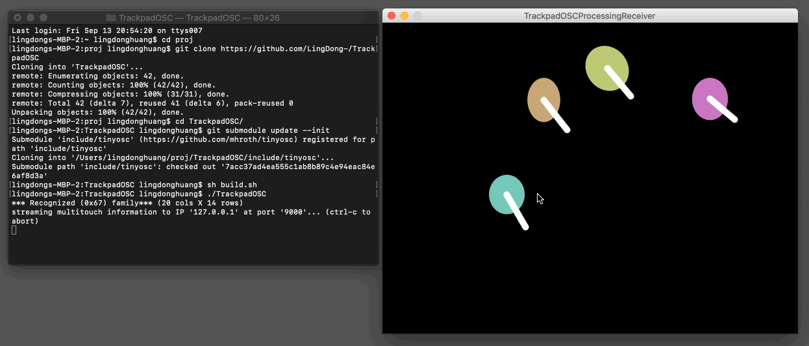

# TrackpadOSC

Send mac's multitouch trackpad read-out through OSC, so apps you make can be controlled with custom gestures.

It's a really simple gluing together of [this Objective-C code](https://web.archive.org/web/20151012175118/http://steike.com/code/multitouch/) and the [tiny OSC library](https://github.com/mhroth/tinyosc).

A [Processing](http://processing.org) and an [OpenFrameworks](http://openframeworks.cc) receiver examples are included in `/demos` folder.



## Installation & Usage

A pre-built binary `TrackpadOSC` is included and can be run by double-clicking on it. However it may or may be compatible with your system. Read below for some straightforward steps to re-compile it:

First load the dependencies:

```
git submodule update --init
```
Then, compile using:

```
sh build.sh
```
You should get a binary named `TrackpadOSC`. That's it! Run it by typing

```
./TrackpadOSC
```
If you want to specify the host and port, simply do

```
./TrackpadOSC 127.0.0.1:9527
```

## Parsing Received Data

All trackpad info are sent to the OSC Address `/trackpad`, as a string encoded in XML format. Here is an example:

```
<multitouch timestamp='608048.937'>

	<finger 
		id='3'
		frame='1791' 
		angle='90.000' 
		ellipse='10.190,8.930'
		position='0.124643661,0.827576339' 
		velocity='0.038,-0.055'
		state='4'
		size='1.074'
	/>
		
	<finger
		id='8'
		frame='1791' 
		angle='80.000' 
		ellipse='12.190,9.930'
		position='0.324643661,0.927576339' 
		velocity='0.039,-0.025'
		state='4'
		size='1.035'
	/>
	
	...

</multitouch>

```

(Newlines are added here for readability, but are not sent by the actual software)

Checkout the demos in `/demos` folder on more receiving and parsing details.

## Notes & References

- Finger positions are normalized, with left edge being x=0, right edge being x=1, top edge being y=1, and bottom edge being y=0. In other words, if you're sitting in front of your laptop, (0,0) points toward your left chest. Notice the anti-intuitive flipping of y-axis.

- Much of the code is adapted from [https://web.archive.org/web/20151012175118/http://steike.com/code/multitouch/](https://web.archive.org/web/20151012175118/http://steike.com/code/multitouch/). Check out their comments for more info.

- [tinyosc](https://github.com/mhroth/tinyosc) is used to send OSC data. If you want to modify OSC related things (e.g. you don't like the XML string and would like to send floats to different OSC addresses), check out that repo for the OSC functions.

- Remember to turn of mac's system gestures so that they don't interfere, by going to System Preferences → Trackpad → More Gestures, and unchecking everything.